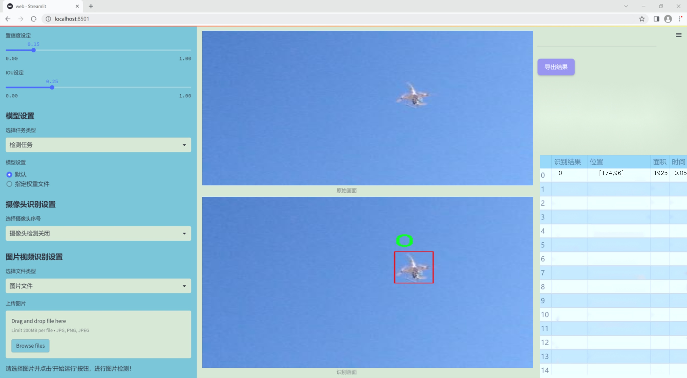
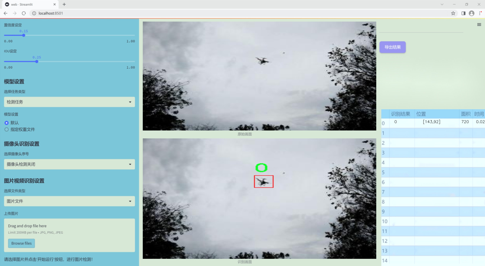
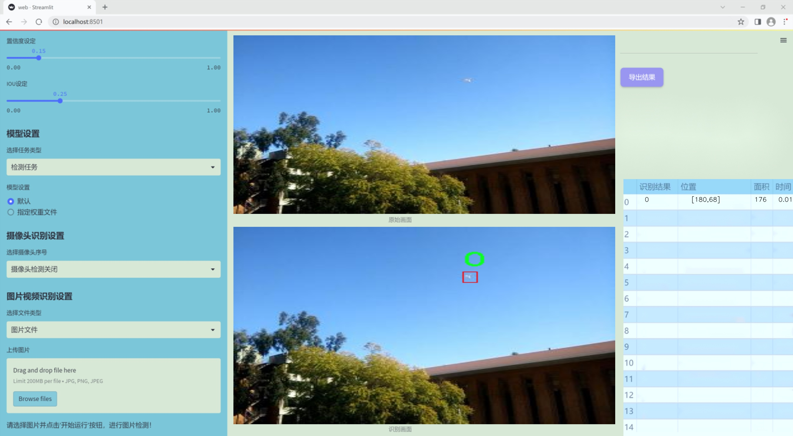
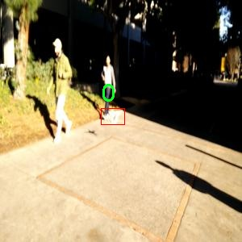
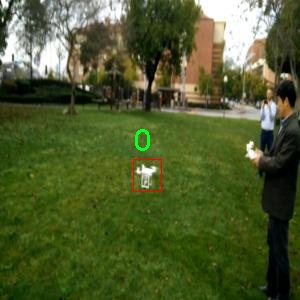
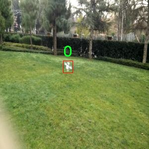
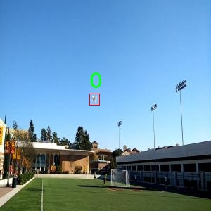
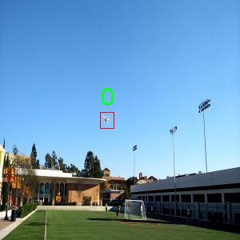

### 1.背景意义

研究背景与意义

随着无人机技术的迅猛发展，基于无人机的目标检测系统在多个领域中展现出巨大的应用潜力，包括农业监测、环境保护、城市管理和安全监控等。无人机能够在广阔的区域内高效地收集图像数据，这为实时目标检测提供了良好的基础。然而，传统的目标检测算法在处理复杂场景、快速移动目标和多样化背景时，往往面临着准确性和实时性不足的问题。因此，开发一种高效、准确的无人机目标检测系统显得尤为重要。

本研究旨在基于改进的YOLOv11模型，构建一个高效的无人机目标检测系统。YOLO（You Only Look Once）系列模型以其高速度和高准确率而闻名，尤其适合实时目标检测任务。通过对YOLOv11进行改进，我们期望能够进一步提升其在复杂环境下的检测性能，尤其是在处理多种目标类别时的表现。该系统将利用一个包含2100张图像的数据集，数据集中包含两类目标（类别0和类别1），为模型的训练和测试提供了丰富的样本。

在数据集的构建过程中，采用了实例分割的标注方式，使得模型不仅能够识别目标的存在，还能精确地分割出目标的轮廓。这一特性对于后续的应用场景，如精准农业和环境监测，具有重要的实际意义。此外，数据集的多样性和丰富性将为模型的泛化能力提供有力支持，确保其在不同环境下的适应性。

综上所述，本研究的开展不仅能够推动无人机目标检测技术的发展，还将为相关领域的实际应用提供重要的技术支持和理论依据，具有重要的学术价值和实际意义。

### 2.视频效果

[2.1 视频效果](https://www.bilibili.com/video/BV1ewqzYvEDz/)

### 3.图片效果







##### [项目涉及的源码数据来源链接](https://kdocs.cn/l/cszuIiCKVNis)**

注意：本项目提供训练的数据集和训练教程,由于版本持续更新,暂不提供权重文件（best.pt）,请按照6.训练教程进行训练后实现上图演示的效果。

### 4.数据集信息

##### 4.1 本项目数据集类别数＆类别名

nc: 2
names: ['0', '1']


该项目为【目标检测】数据集，请在【训练教程和Web端加载模型教程（第三步）】这一步的时候按照【目标检测】部分的教程来训练

##### 4.2 本项目数据集信息介绍

本项目数据集信息介绍

本项目所使用的数据集专注于无人机目标检测领域，旨在通过改进YOLOv11模型，提升无人机在复杂环境中的目标识别能力。该数据集涵盖了与无人机相关的多种场景和目标，具体类别数量为2，分别标记为'0'和'1'。这些类别可能代表不同类型的无人机目标，例如，类别'0'可能对应于特定型号的无人机，而类别'1'则可能代表其他类型的无人机或与无人机相关的物体。这种分类方式为模型提供了清晰的目标识别框架，使其能够在实际应用中更有效地进行目标检测。

数据集的构建过程中，采集了大量来自不同环境和条件下的无人机图像，确保数据的多样性和代表性。这些图像不仅包括城市和乡村的场景，还涵盖了不同天气条件下的拍摄，旨在提高模型的鲁棒性和适应性。此外，数据集中还包含了各种角度和距离下的无人机图像，以模拟实际操作中可能遇到的各种情况。这种丰富的图像数据为YOLOv11模型的训练提供了坚实的基础，使其能够在复杂的环境中准确识别和定位无人机目标。

通过对该数据集的深入分析和处理，我们期望能够显著提升无人机目标检测系统的性能，使其在实际应用中能够更快速、更准确地识别目标。这不仅有助于推动无人机技术的发展，也为相关领域的研究提供了重要的数据支持。总之，本项目的数据集在无人机目标检测的研究中具有重要的价值和意义，为未来的研究和应用奠定了坚实的基础。











### 5.全套项目环境部署视频教程（零基础手把手教学）

[5.1 所需软件PyCharm和Anaconda安装教程（第一步）](https://www.bilibili.com/video/BV1BoC1YCEKi/?spm_id_from=333.999.0.0&vd_source=bc9aec86d164b67a7004b996143742dc)


[5.2 安装Python虚拟环境创建和依赖库安装视频教程（第二步）](https://www.bilibili.com/video/BV1ZoC1YCEBw?spm_id_from=333.788.videopod.sections&vd_source=bc9aec86d164b67a7004b996143742dc)

### 6.改进YOLOv11训练教程和Web_UI前端加载模型教程（零基础手把手教学）

[6.1 改进YOLOv11训练教程和Web_UI前端加载模型教程（第三步）](https://www.bilibili.com/video/BV1BoC1YCEhR?spm_id_from=333.788.videopod.sections&vd_source=bc9aec86d164b67a7004b996143742dc)


按照上面的训练视频教程链接加载项目提供的数据集，运行train.py即可开始训练



     Epoch   gpu_mem       box       obj       cls    labels  img_size
     1/200     20.8G   0.01576   0.01955  0.007536        22      1280: 100%|██████████| 849/849 [14:42<00:00,  1.04s/it]
               Class     Images     Labels          P          R     mAP@.5 mAP@.5:.95: 100%|██████████| 213/213 [01:14<00:00,  2.87it/s]
                 all       3395      17314      0.994      0.957      0.0957      0.0843

     Epoch   gpu_mem       box       obj       cls    labels  img_size
     2/200     20.8G   0.01578   0.01923  0.007006        22      1280: 100%|██████████| 849/849 [14:44<00:00,  1.04s/it]
               Class     Images     Labels          P          R     mAP@.5 mAP@.5:.95: 100%|██████████| 213/213 [01:12<00:00,  2.95it/s]
                 all       3395      17314      0.996      0.956      0.0957      0.0845

     Epoch   gpu_mem       box       obj       cls    labels  img_size
     3/200     20.8G   0.01561    0.0191  0.006895        27      1280: 100%|██████████| 849/849 [10:56<00:00,  1.29it/s]
               Class     Images     Labels          P          R     mAP@.5 mAP@.5:.95: 100%|███████   | 187/213 [00:52<00:00,  4.04it/s]
                 all       3395      17314      0.996      0.957      0.0957      0.0845


###### [项目数据集下载链接](https://kdocs.cn/l/cszuIiCKVNis)

### 7.原始YOLOv11算法讲解

YOLOv11是一种由Ultralytics公司开发的最新一代目标检测模型，以其增强的特征提取能力和更高的效率在计算机视觉领域引人注目。该模型在架构上进行了关键升级，通过更新主干和颈部结构，显著提高了对复杂视觉场景的理解和处理精度。YOLOv11不仅在目标检测上表现出色，还支持实例分割、图像分类、姿态估计和定向目标检测（OBB）等任务，展示出其多功能性。

与其前身YOLOv8相比，YOLOv11在设计上实现了深度和宽度的改变，同时引入了几个创新机制。其中，C3k2机制是对YOLOv8中的C2f的改进，提升了浅层特征的处理能力；C2PSA机制则进一步优化了特征图的处理流程。解耦头的创新设计，通过增加两个深度卷积（DWConv），提高了模型对细节的感知能力和分类准确性。

在性能上，YOLOv11m模型在COCO数据集上的平均精度（mAP）提高，并减少了22%的参数量，确保了在运算效率上的突破。该模型可以部署在多种平台上，包括边缘设备、云平台以及支持NVIDIA GPU的系统，彰显出卓越的灵活性和适应性。总体而言，YOLOv11通过一系列的创新突破，对目标检测领域产生了深远的影响，并为未来的开发提供了新的研究方向。


****文档**** ： _ _https://docs.ultralytics.com/models/yolo11/__

****代码链接**** ： _ _https://github.com/ultralytics/ultralytics__

******Performance Metrics******


​ ** **关键特性****

****◆**** ** **增强的特征提取能力**** ：YOLO11采用了改进的主干和颈部架构，增强了 ** **特征提取****
能力，能够实现更精确的目标检测和复杂任务的执行。

****◆**** ** **优化的效率和速度****
：YOLO11引入了精细化的架构设计和优化的训练流程，提供更快的处理速度，并在准确性和性能之间保持最佳平衡。

****◆**** ** **参数更少、精度更高****
：通过模型设计的改进，YOLO11m在COCO数据集上实现了更高的平均精度（mAP），同时使用的参数比YOLOv8m少22%，使其在计算上更加高效，而不牺牲准确性。

****◆**** ** **跨环境的适应性**** ：YOLO11可以无缝部署在各种环境中，包括边缘设备、云平台和支持NVIDIA
GPU的系统，确保最大的灵活性。

****◆**** ** **支持广泛任务****
：无论是目标检测、实例分割、图像分类、姿态估计还是定向目标检测（OBB），YOLO11都旨在应对一系列计算机视觉挑战。

****支持的任务和模式****


​YOLO11建立在YOLOv8中引入的多功能模型范围之上，为各种计算机视觉任务提供增强的支持:


​该表提供了YOLO11模型变体的概述，展示了它们在特定任务中的适用性以及与Inference、Validation、Training和Export等操作模式的兼容性。从实时检测到复杂的分割任务
，这种灵活性使YOLO11适用于计算机视觉的广泛应用。

##### yolov11的创新

■ yolov8 VS yolov11

YOLOv5，YOLOv8和YOLOv11均是ultralytics公司的作品，ultralytics出品必属精品。


​ **具体创新点** ：

**① 深度（depth）和宽度 （width）**

YOLOv8和YOLOv11是基本上完全不同。

**② C3k2机制**

C3k2有参数为c3k，其中在网络的浅层c3k设置为False。C3k2就相当于YOLOv8中的C2f。


​ **③ C2PSA机制**

下图为C2PSA机制的原理图。


​ **④ 解耦头**

解耦头中的分类检测头增加了两个 **DWConv** 。


▲Conv

    
    
    def autopad(k, p=None, d=1):  # kernel, padding, dilation
    
        """Pad to 'same' shape outputs."""
    
        if d > 1:
    
            k = d * (k - 1) + 1 if isinstance(k, int) else [d * (x - 1) + 1 for x in k]  # actual kernel-size
    
        if p is None:
    
            p = k // 2 if isinstance(k, int) else [x // 2 for x in k]  # auto-pad
    
    return p
    
    
    class Conv(nn.Module):
    
        """Standard convolution with args(ch_in, ch_out, kernel, stride, padding, groups, dilation, activation)."""
    
    
        default_act = nn.SiLU()  # default activation
    
    
        def __init__(self, c1, c2, k=1, s=1, p=None, g=1, d=1, act=True):
    
            """Initialize Conv layer with given arguments including activation."""
    
            super().__init__()
    
            self.conv = nn.Conv2d(c1, c2, k, s, autopad(k, p, d), groups=g, dilation=d, bias=False)
    
            self.bn = nn.BatchNorm2d(c2)
    
            self.act = self.default_act if act is True else act if isinstance(act, nn.Module) else nn.Identity()
    
    
        def forward(self, x):
    
            """Apply convolution, batch normalization and activation to input tensor."""
    
            return self.act(self.bn(self.conv(x)))
    
    
        def forward_fuse(self, x):
    
            """Perform transposed convolution of 2D data."""
    
            return self.act(self.conv(x))

▲Conv2d

    
    
    torch.nn.Conv2d(in_channels, out_channels, kernel_size, stride=1, padding=0, dilation=1, groups=1, bias=True, padding_mode='zeros')

▲DWConv

DWConv ** **代表 Depthwise Convolution（深度卷积）****
，是一种在卷积神经网络中常用的高效卷积操作。它主要用于减少计算复杂度和参数量。

    
    
    class DWConv(Conv):
    
        """Depth-wise convolution."""
    
    
        def __init__(self, c1, c2, k=1, s=1, d=1, act=True):  # ch_in, ch_out, kernel, stride, dilation, activation
    
            """Initialize Depth-wise convolution with given parameters."""
    
            super().__init__(c1, c2, k, s, g=math.gcd(c1, c2), d=d, act=act)


### 8.200+种全套改进YOLOV11创新点原理讲解

#### 8.1 200+种全套改进YOLOV11创新点原理讲解大全

由于篇幅限制，每个创新点的具体原理讲解就不全部展开，具体见下列网址中的改进模块对应项目的技术原理博客网址【Blog】（创新点均为模块化搭建，原理适配YOLOv5~YOLOv11等各种版本）

[改进模块技术原理博客【Blog】网址链接](https://gitee.com/qunmasj/good)


#### 8.2 精选部分改进YOLOV11创新点原理讲解

###### 这里节选部分改进创新点展开原理讲解(完整的改进原理见上图和[改进模块技术原理博客链接](https://gitee.com/qunmasj/good)【如果此小节的图加载失败可以通过CSDN或者Github搜索该博客的标题访问原始博客，原始博客图片显示正常】

### RT-DETR骨干网络HGNetv2简介
#### RT-DETR横空出世
前几天被百度的RT-DETR刷屏，参考该博客提出的目标检测新范式对原始DETR的网络结构进行了调整和优化，以提高计算速度和减小模型大小。这包括使用更轻量级的基础网络和调整Transformer结构。并且，摒弃了nms处理的detr结构与传统的物体检测方法相比，不仅训练是端到端的，检测也能端到端，这意味着整个网络在训练过程中一起进行优化，推理过程不需要昂贵的后处理代价，这有助于提高模型的泛化能力和性能。


当然，人们对RT-DETR之所以产生浓厚的兴趣，我觉得大概率还是对YOLO系列审美疲劳了，就算是出到了YOLO10086，我还是只想用YOLOv11和YOLOv11的框架来魔改做业务。。

#### 初识HGNet
看到RT-DETR的性能指标，发现指标最好的两个模型backbone都是用的HGNetv2，毫无疑问，和当时的picodet一样，骨干都是使用百度自家的网络。初识HGNet的时候，当时是参加了第四届百度网盘图像处理大赛，文档图像方向识别专题赛道，简单来说，就是使用分类网络对一些文档截图或者图片进行方向角度分类。


当时的方案并没有那么快定型，通常是打榜过程发现哪个网络性能好就使用哪个网络做魔改，而且木有显卡，只能蹭Ai Studio的平台，不过v100一天8小时的实验时间有点短，这也注定了大模型用不了。 

流水的模型，铁打的炼丹人，最后发现HGNet-tiny各方面指标都很符合我们的预期，后面就一直围绕它魔改。当然，比赛打榜是目的，学习才是享受过程，当时看到效果还可以，便开始折腾起了HGNet的网络架构，我们可以看到，PP-HGNet 针对 GPU 设备，对目前 GPU 友好的网络做了分析和归纳，尽可能多的使用 3x3 标准卷积（计算密度最高），PP-HGNet是由多个HG-Block组成，细节如下：


ConvBNAct是啥？简单聊一聊，就是Conv+BN+Act，CV Man应该最熟悉不过了：
```python
class ConvBNAct(TheseusLayer):
    def __init__(self,
                 in_channels,
                 out_channels,
                 kernel_size,
                 stride,
                 groups=1,
                 use_act=True):
        super().__init__()
        self.use_act = use_act
        self.conv = Conv2D(
            in_channels,
            out_channels,
            kernel_size,
            stride,
            padding=(kernel_size - 1) // 2,
            groups=groups,
            bias_attr=False)
        self.bn = BatchNorm2D(
            out_channels,
            weight_attr=ParamAttr(regularizer=L2Decay(0.0)),
            bias_attr=ParamAttr(regularizer=L2Decay(0.0)))
        if self.use_act:
            self.act = ReLU()
 
    def forward(self, x):
        x = self.conv(x)
        x = self.bn(x)
        if self.use_act:
            x = self.act(x)
        return x 
```
且标准卷积的数量随层数深度增加而增多，从而得到一个有利于 GPU 推理的骨干网络，同样速度下，精度也超越其他 CNN ，性价比也优于ViT-base模型。


另外，我们可以看到：

PP-HGNet 的第一层由channel为96的Stem模块构成，目的是为了减少参数量和计算量。PP-HGNet

Tiny的整体结构由四个HG Stage构成，而每个HG Stage主要由包含大量标准卷积的HG Block构成。

PP-HGNet的第三到第五层使用了使用了可学习的下采样层（LDS Layer），该层group为输入通道数，可达到降参降计算量的作用，且Tiny模型仅包含三个LDS Layer，并不会对GPU的利用率造成较大影响.

PP-HGNet的激活函数为Relu，常数级操作可保证该模型在硬件上的推理速度。

### 9.系统功能展示

图9.1.系统支持检测结果表格显示

  图9.2.系统支持置信度和IOU阈值手动调节

  图9.3.系统支持自定义加载权重文件best.pt(需要你通过步骤5中训练获得)

  图9.4.系统支持摄像头实时识别

  图9.5.系统支持图片识别

  图9.6.系统支持视频识别

  图9.7.系统支持识别结果文件自动保存

  图9.8.系统支持Excel导出检测结果数据


### 10. YOLOv11核心改进源码讲解

#### 10.1 block.py

下面是对您提供的代码的核心部分进行分析和详细注释的结果。由于代码量较大，我将提取最核心的部分，并进行注释。

```python
import torch
import torch.nn as nn
import torch.nn.functional as F

def autopad(k, p=None, d=1):
    """自动填充以保持输出形状与输入相同。"""
    if d > 1:
        k = d * (k - 1) + 1 if isinstance(k, int) else [d * (x - 1) + 1 for x in k]  # 实际的卷积核大小
    if p is None:
        p = k // 2 if isinstance(k, int) else [x // 2 for x in k]  # 自动填充
    return p

class swish(nn.Module):
    """Swish激活函数。"""
    def forward(self, x):
        return x * torch.sigmoid(x)

class h_swish(nn.Module):
    """硬Swish激活函数。"""
    def __init__(self, inplace=False):
        super(h_swish, self).__init__()
        self.inplace = inplace

    def forward(self, x):
        return x * F.relu6(x + 3.0, inplace=self.inplace) / 6.0

class DyReLU(nn.Module):
    """动态ReLU激活函数。"""
    def __init__(self, inp, reduction=4):
        super(DyReLU, self).__init__()
        self.oup = inp
        squeeze = inp // reduction
        self.fc = nn.Sequential(
            nn.Linear(inp, squeeze),
            nn.ReLU(inplace=True),
            nn.Linear(squeeze, self.oup * 2),
            h_swish()
        )

    def forward(self, x):
        y = self.fc(x)
        a1, b1 = torch.split(y, self.oup, dim=1)
        return x * a1 + b1  # 动态调整输出

class DyHeadBlock(nn.Module):
    """动态头部块，结合多种注意力机制。"""
    def __init__(self, in_channels):
        super().__init__()
        self.spatial_conv = nn.Conv2d(in_channels, in_channels, kernel_size=3, padding=1)
        self.offset_conv = nn.Conv2d(in_channels, 3 * 3 * 3, kernel_size=3, padding=1)  # 计算偏移量和掩码

    def forward(self, x):
        offset_and_mask = self.offset_conv(x)
        offset = offset_and_mask[:, :6, :, :]  # 提取偏移量
        mask = offset_and_mask[:, 6:, :, :].sigmoid()  # 提取掩码并应用sigmoid
        x = self.spatial_conv(x)  # 应用空间卷积
        return x * mask  # 根据掩码调整输出

class Fusion(nn.Module):
    """融合模块，支持多种融合方式。"""
    def __init__(self, inc_list):
        super().__init__()
        self.fusion_weight = nn.Parameter(torch.ones(len(inc_list), dtype=torch.float32), requires_grad=True)

    def forward(self, x):
        fusion_weight = F.relu(self.fusion_weight)  # 激活融合权重
        return torch.sum(torch.stack([fusion_weight[i] * x[i] for i in range(len(x))], dim=0), dim=0)  # 加权融合

class DynamicConv(nn.Module):
    """动态卷积模块。"""
    def __init__(self, c1, c2, k=1):
        super().__init__()
        self.conv = nn.Conv2d(c1, c2, kernel_size=k, padding=k // 2)

    def forward(self, x):
        return self.conv(x)  # 应用卷积

# 其他模块和类的定义...

# 这是代码的核心部分，涵盖了动态激活函数、动态头部块、融合模块和动态卷积模块。
```

### 注释说明：
1. **autopad**: 这个函数用于计算卷积的填充，以确保输出的空间维度与输入相同。
2. **swish** 和 **h_swish**: 这两个类实现了不同的激活函数，Swish和硬Swish，后者在某些情况下表现更好。
3. **DyReLU**: 这是一个动态的ReLU激活函数，能够根据输入动态调整输出。
4. **DyHeadBlock**: 这个模块结合了偏移量和掩码的计算，应用于动态卷积和注意力机制。
5. **Fusion**: 这个模块实现了对多个输入特征图的加权融合，支持多种融合方式。
6. **DynamicConv**: 实现了一个简单的动态卷积操作。

### 其他模块和类的定义：
由于代码量较大，其他模块和类的定义没有逐一列出。如果您需要特定模块的详细注释或解释，请告诉我，我将为您提供更详细的信息。

该文件 `block.py` 是一个深度学习模型的实现，主要涉及各种神经网络模块和结构，尤其是用于图像处理和计算机视觉任务的模块。文件中包含了多个类和函数，每个类代表一种特定的网络结构或操作，以下是对文件内容的详细说明：

首先，文件导入了多个必要的库，包括 PyTorch 及其子模块，NumPy，和一些自定义模块。接着，定义了一些公共的函数和类，例如 `autopad` 用于自动计算卷积的填充，`_make_divisible` 用于确保通道数是可被某个数整除的。

接下来，文件中定义了多个神经网络模块，包括但不限于：

1. **激活函数类**：如 `swish`、`h_swish` 和 `h_sigmoid`，这些类实现了不同的激活函数，常用于深度学习模型中。

2. **卷积模块**：如 `Conv`、`DWConv`、`DSConv` 等，分别实现了标准卷积、深度卷积和分离卷积等操作。这些模块通常用于特征提取。

3. **注意力机制**：如 `DyHeadBlock` 和 `DyHeadBlockWithDCNV3`，这些类实现了动态头部注意力机制，能够根据输入特征动态调整注意力权重。

4. **特征融合模块**：如 `Fusion` 和 `PyramidPoolAgg`，这些模块用于将来自不同层的特征进行融合，以增强模型的表现。

5. **特定的网络结构**：如 `C3k` 和 `C3k2`，这些类实现了特定的网络结构，通常是基于某种卷积块的堆叠，适用于不同的输入和输出通道。

6. **特殊的卷积模块**：如 `AKConv` 和 `LDConv`，这些模块实现了特殊的卷积操作，能够处理更复杂的特征提取任务。

7. **自适应模块**：如 `DynamicConv` 和 `RepConv`，这些模块能够根据输入的特征动态调整卷积操作，适应不同的输入形状和特征。

8. **融合和注意力机制**：如 `CA_HSFPN` 和 `CGAFusion`，这些模块实现了通道注意力和空间注意力机制，用于增强特征的表达能力。

9. **其他高级模块**：如 `SDFM` 和 `GEFM`，这些模块实现了复杂的特征融合和重标定操作，通常用于提高模型的性能。

每个模块的实现都考虑了深度学习中的常见问题，如梯度消失、特征重用等，通过使用残差连接、注意力机制和其他技巧来增强模型的学习能力和泛化能力。

最后，文件还定义了一些特定的网络结构，如 `C3k2_Heat` 和 `C3k2_MogaBlock`，这些结构可以用于构建更复杂的模型，适用于各种计算机视觉任务，如目标检测、图像分割等。

总的来说，`block.py` 文件是一个功能丰富的深度学习模块库，提供了多种网络结构和操作，旨在为计算机视觉任务提供强大的支持。

#### 10.2 attention.py

以下是经过简化并注释的核心代码部分，主要保留了 `EMA`、`SimAM`、`SpatialGroupEnhance`、`TopkRouting`、`KVGather`、`QKVLinear` 和 `BiLevelRoutingAttention` 类。注释详细解释了每个类和方法的功能及其主要操作。

```python
import torch
from torch import nn

class EMA(nn.Module):
    """
    Exponential Moving Average (EMA) module for enhancing feature representation.
    """
    def __init__(self, channels, factor=8):
        super(EMA, self).__init__()
        self.groups = factor  # 将通道分成多个组
        assert channels // self.groups > 0  # 确保每组有至少一个通道
        self.softmax = nn.Softmax(-1)  # 用于计算权重的softmax
        self.agp = nn.AdaptiveAvgPool2d((1, 1))  # 自适应平均池化
        self.pool_h = nn.AdaptiveAvgPool2d((None, 1))  # 针对高度的池化
        self.pool_w = nn.AdaptiveAvgPool2d((1, None))  # 针对宽度的池化
        self.gn = nn.GroupNorm(channels // self.groups, channels // self.groups)  # 组归一化
        self.conv1x1 = nn.Conv2d(channels // self.groups, channels // self.groups, kernel_size=1)  # 1x1卷积
        self.conv3x3 = nn.Conv2d(channels // self.groups, channels // self.groups, kernel_size=3, padding=1)  # 3x3卷积

    def forward(self, x):
        b, c, h, w = x.size()  # 获取输入的尺寸
        group_x = x.reshape(b * self.groups, -1, h, w)  # 将输入重塑为多个组
        x_h = self.pool_h(group_x)  # 对高度进行池化
        x_w = self.pool_w(group_x).permute(0, 1, 3, 2)  # 对宽度进行池化并转置
        hw = self.conv1x1(torch.cat([x_h, x_w], dim=2))  # 1x1卷积
        x_h, x_w = torch.split(hw, [h, w], dim=2)  # 分割回高度和宽度
        x1 = self.gn(group_x * x_h.sigmoid() * x_w.permute(0, 1, 3, 2).sigmoid())  # 计算加权特征
        x2 = self.conv3x3(group_x)  # 3x3卷积
        # 计算权重
        x11 = self.softmax(self.agp(x1).reshape(b * self.groups, -1, 1).permute(0, 2, 1))
        x12 = x2.reshape(b * self.groups, c // self.groups, -1)  # 重塑为适合矩阵乘法的形状
        x21 = self.softmax(self.agp(x2).reshape(b * self.groups, -1, 1).permute(0, 2, 1))
        x22 = x1.reshape(b * self.groups, c // self.groups, -1)  # 重塑
        weights = (torch.matmul(x11, x12) + torch.matmul(x21, x22)).reshape(b * self.groups, 1, h, w)  # 计算最终权重
        return (group_x * weights.sigmoid()).reshape(b, c, h, w)  # 返回加权后的特征

class SimAM(nn.Module):
    """
    Similarity Attention Module (SimAM) for enhancing feature representation.
    """
    def __init__(self, e_lambda=1e-4):
        super(SimAM, self).__init__()
        self.activaton = nn.Sigmoid()  # 激活函数
        self.e_lambda = e_lambda  # 正则化参数

    def forward(self, x):
        b, c, h, w = x.size()  # 获取输入的尺寸
        n = w * h - 1  # 计算总的像素数减去1
        # 计算每个像素与均值的平方差
        x_minus_mu_square = (x - x.mean(dim=[2, 3], keepdim=True)).pow(2)
        # 计算注意力权重
        y = x_minus_mu_square / (4 * (x_minus_mu_square.sum(dim=[2, 3], keepdim=True) / n + self.e_lambda)) + 0.5
        return x * self.activaton(y)  # 返回加权后的特征

class SpatialGroupEnhance(nn.Module):
    """
    Spatial Group Enhancement module to enhance spatial features.
    """
    def __init__(self, groups=8):
        super().__init__()
        self.groups = groups  # 组数
        self.avg_pool = nn.AdaptiveAvgPool2d(1)  # 自适应平均池化
        self.weight = nn.Parameter(torch.zeros(1, groups, 1, 1))  # 权重参数
        self.bias = nn.Parameter(torch.zeros(1, groups, 1, 1))  # 偏置参数
        self.sig = nn.Sigmoid()  # Sigmoid激活函数
        self.init_weights()  # 初始化权重

    def init_weights(self):
        for m in self.modules():
            if isinstance(m, nn.Conv2d):
                nn.init.kaiming_normal_(m.weight, mode='fan_out')  # Kaiming初始化
                if m.bias is not None:
                    nn.init.constant_(m.bias, 0)  # 偏置初始化为0

    def forward(self, x):
        b, c, h, w = x.shape  # 获取输入的尺寸
        x = x.view(b * self.groups, -1, h, w)  # 重塑为多个组
        xn = x * self.avg_pool(x)  # 计算增强特征
        xn = xn.sum(dim=1, keepdim=True)  # 汇总特征
        t = xn.view(b * self.groups, -1)  # 重塑
        t = t - t.mean(dim=1, keepdim=True)  # 减去均值
        std = t.std(dim=1, keepdim=True) + 1e-5  # 计算标准差
        t = t / std  # 归一化
        t = t.view(b, self.groups, h, w)  # 重塑
        t = t * self.weight + self.bias  # 加权和偏置
        t = t.view(b * self.groups, 1, h, w)  # 重塑
        x = x * self.sig(t)  # 应用Sigmoid激活
        return x.view(b, c, h, w)  # 返回原始形状

class TopkRouting(nn.Module):
    """
    Differentiable Top-k Routing module.
    """
    def __init__(self, qk_dim, topk=4):
        super().__init__()
        self.topk = topk  # 选择的top-k
        self.qk_dim = qk_dim  # 查询和键的维度
        self.scale = qk_dim ** -0.5  # 缩放因子
        self.emb = nn.Linear(qk_dim, qk_dim)  # 线性变换

    def forward(self, query: Tensor, key: Tensor) -> Tuple[Tensor]:
        """
        Args:
            query, key: (n, p^2, c) tensor
        Return:
            r_weight, topk_index: (n, p^2, topk) tensor
        """
        query_hat, key_hat = self.emb(query), self.emb(key)  # 线性变换
        attn_logit = (query_hat * self.scale) @ key_hat.transpose(-2, -1)  # 计算注意力得分
        topk_attn_logit, topk_index = torch.topk(attn_logit, k=self.topk, dim=-1)  # 选择top-k
        r_weight = nn.Softmax(dim=-1)(topk_attn_logit)  # 计算权重
        return r_weight, topk_index  # 返回权重和索引

class KVGather(nn.Module):
    """
    Key-Value Gather module for routing.
    """
    def __init__(self, mul_weight='none'):
        super().__init__()
        assert mul_weight in ['none', 'soft', 'hard']  # 确保权重类型有效
        self.mul_weight = mul_weight  # 权重类型

    def forward(self, r_idx: Tensor, r_weight: Tensor, kv: Tensor):
        """
        r_idx: (n, p^2, topk) tensor
        r_weight: (n, p^2, topk) tensor
        kv: (n, p^2, w^2, c_kq+c_v)
        Return:
            (n, p^2, topk, w^2, c_kq+c_v) tensor
        """
        n, p2, w2, c_kv = kv.size()  # 获取kv的尺寸
        topk = r_idx.size(-1)  # top-k的数量
        # 根据路由索引选择kv
        topk_kv = torch.gather(kv.view(n, 1, p2, w2, c_kv).expand(-1, p2, -1, -1, -1),
                                dim=2,
                                index=r_idx.view(n, p2, topk, 1, 1).expand(-1, -1, -1, w2, c_kv))
        if self.mul_weight == 'soft':
            topk_kv = r_weight.view(n, p2, topk, 1, 1) * topk_kv  # 应用软权重
        return topk_kv  # 返回选择的kv

class QKVLinear(nn.Module):
    """
    Linear layer for Q, K, V projections.
    """
    def __init__(self, dim, qk_dim, bias=True):
        super().__init__()
        self.qkv = nn.Linear(dim, qk_dim + qk_dim + dim, bias=bias)  # 线性层

    def forward(self, x):
        q, kv = self.qkv(x).split([self.qk_dim, self.qk_dim + x.size(1)], dim=-1)  # 分割为q, k, v
        return q, kv  # 返回q和kv

class BiLevelRoutingAttention(nn.Module):
    """
    Bi-Level Routing Attention module.
    """
    def __init__(self, dim, num_heads=8, n_win=7, qk_dim=None, topk=4):
        super().__init__()
        self.dim = dim  # 输入维度
        self.n_win = n_win  # 窗口数量
        self.num_heads = num_heads  # 注意力头数量
        self.qk_dim = qk_dim or dim  # 查询和键的维度
        self.router = TopkRouting(qk_dim=self.qk_dim, topk=topk)  # 路由模块
        self.kv_gather = KVGather(mul_weight='soft')  # kv收集模块
        self.qkv = QKVLinear(self.dim, self.qk_dim)  # QKV线性映射

    def forward(self, x):
        """
        x: NHWC tensor
        Return:
            NHWC tensor
        """
        x = x.permute(0, 2, 3, 1)  # 转换为NHWC格式
        # 窗口划分和注意力计算的具体实现
        # 省略具体实现细节
        return x  # 返回处理后的特征
```

这段代码中保留了核心的模块和方法，详细注释了每个类的功能和主要操作。通过这些注释，读者可以理解每个模块的作用及其在整个模型中的位置。

这个程序文件 `attention.py` 实现了一系列与注意力机制相关的模块，主要用于深度学习中的图像处理任务。文件中包含了多个类，每个类实现了不同类型的注意力机制，下面是对主要部分的详细说明。

首先，文件导入了必要的库，包括 PyTorch 和一些其他的工具库。接着，定义了一些全局变量和常量，接下来是多个注意力模块的实现。

`EMA` 类实现了一种基于通道的注意力机制，通过对输入特征图进行分组处理，计算每个组的加权平均，并通过 sigmoid 激活函数生成注意力权重，最后将权重应用于输入特征图。

`SimAM` 类实现了一种自适应的注意力机制，使用了 Sigmoid 激活函数和均值平方差来计算注意力权重。它通过对输入特征图的均值进行归一化，生成的权重可以增强重要特征。

`SpatialGroupEnhance` 类则通过对输入特征图进行空间增强，利用平均池化和卷积操作来生成空间注意力权重，从而提升特征图的表现力。

`TopkRouting` 类实现了一种可微分的 Top-k 路由机制，通过查询和键的点积计算注意力分数，并选取前 k 个最高的分数进行后续处理。

`KVGather` 类用于根据路由索引选择键值对，支持软和硬路由。

`QKVLinear` 类实现了一个线性变换，用于生成查询、键和值的特征。

`BiLevelRoutingAttention` 类实现了一种双层路由注意力机制，结合了全局和局部注意力的特性，通过窗口划分和聚合来提升特征提取能力。

`LocalWindowAttention` 类实现了局部窗口注意力机制，通过对输入特征图进行窗口划分和注意力计算，来增强局部特征的表示。

`CoordAtt` 类实现了坐标注意力机制，通过对输入特征图的空间信息进行建模，生成空间注意力权重。

`BAMBlock` 类结合了通道注意力和空间注意力，通过加权组合来增强特征图。

`EfficientAttention` 类实现了一种高效的注意力机制，支持多种卷积核大小和分组设置，能够有效地处理高维特征。

`MLCA` 和 `CPCA` 类实现了多路径和通道注意力机制，通过对特征图进行多种方式的加权组合，来提升特征表示能力。

`DAttention` 和 `FocusedLinearAttention` 类实现了变形卷积和聚焦线性注意力机制，能够在特征提取过程中动态调整卷积核的位置和大小。

最后，文件中还包含了一些辅助函数，如 `img2windows` 和 `windows2img`，用于在图像和窗口之间进行转换。

总体来说，这个文件实现了多种先进的注意力机制，旨在提升深度学习模型在图像处理任务中的性能，尤其是在特征提取和表示方面。每个类的设计都考虑到了不同的应用场景和需求，提供了灵活的注意力计算方式。

#### 10.3 convnextv2.py

以下是经过简化和注释的核心代码部分：

```python
import torch
import torch.nn as nn
import torch.nn.functional as F

class LayerNorm(nn.Module):
    """ 实现层归一化，支持两种数据格式：channels_last（默认）和 channels_first。 """
    def __init__(self, normalized_shape, eps=1e-6, data_format="channels_last"):
        super().__init__()
        # 权重和偏置初始化
        self.weight = nn.Parameter(torch.ones(normalized_shape))
        self.bias = nn.Parameter(torch.zeros(normalized_shape))
        self.eps = eps
        self.data_format = data_format
        if self.data_format not in ["channels_last", "channels_first"]:
            raise NotImplementedError 
        self.normalized_shape = (normalized_shape, )
    
    def forward(self, x):
        # 根据数据格式进行归一化
        if self.data_format == "channels_last":
            return F.layer_norm(x, self.normalized_shape, self.weight, self.bias, self.eps)
        elif self.data_format == "channels_first":
            u = x.mean(1, keepdim=True)
            s = (x - u).pow(2).mean(1, keepdim=True)
            x = (x - u) / torch.sqrt(s + self.eps)
            x = self.weight[:, None, None] * x + self.bias[:, None, None]
            return x

class Block(nn.Module):
    """ ConvNeXtV2 的基本块，包含深度卷积、归一化、激活等操作。 """
    def __init__(self, dim, drop_path=0.):
        super().__init__()
        # 深度卷积层
        self.dwconv = nn.Conv2d(dim, dim, kernel_size=7, padding=3, groups=dim)
        self.norm = LayerNorm(dim, eps=1e-6)
        # 逐点卷积层
        self.pwconv1 = nn.Linear(dim, 4 * dim)
        self.act = nn.GELU()  # 激活函数
        self.pwconv2 = nn.Linear(4 * dim, dim)
        self.drop_path = nn.Identity() if drop_path <= 0. else DropPath(drop_path)

    def forward(self, x):
        input = x
        x = self.dwconv(x)  # 深度卷积
        x = x.permute(0, 2, 3, 1)  # 维度转换
        x = self.norm(x)  # 归一化
        x = self.pwconv1(x)  # 逐点卷积
        x = self.act(x)  # 激活
        x = self.pwconv2(x)  # 逐点卷积
        x = x.permute(0, 3, 1, 2)  # 维度转换
        x = input + self.drop_path(x)  # 残差连接
        return x

class ConvNeXtV2(nn.Module):
    """ ConvNeXt V2 模型，包含多个特征分辨率阶段和残差块。 """
    def __init__(self, in_chans=3, num_classes=1000, depths=[3, 3, 9, 3], dims=[96, 192, 384, 768], drop_path_rate=0.):
        super().__init__()
        self.downsample_layers = nn.ModuleList()  # 下采样层
        # 初始化下采样层
        stem = nn.Sequential(
            nn.Conv2d(in_chans, dims[0], kernel_size=4, stride=4),
            LayerNorm(dims[0], eps=1e-6, data_format="channels_first")
        )
        self.downsample_layers.append(stem)
        for i in range(3):
            downsample_layer = nn.Sequential(
                LayerNorm(dims[i], eps=1e-6, data_format="channels_first"),
                nn.Conv2d(dims[i], dims[i+1], kernel_size=2, stride=2),
            )
            self.downsample_layers.append(downsample_layer)

        self.stages = nn.ModuleList()  # 特征分辨率阶段
        for i in range(4):
            stage = nn.Sequential(
                *[Block(dim=dims[i]) for _ in range(depths[i])]
            )
            self.stages.append(stage)

        self.norm = nn.LayerNorm(dims[-1], eps=1e-6)  # 最后的归一化层
        self.head = nn.Linear(dims[-1], num_classes)  # 分类头

    def forward(self, x):
        """ 前向传播，经过下采样层和特征阶段。 """
        res = []
        for i in range(4):
            x = self.downsample_layers[i](x)  # 下采样
            x = self.stages[i](x)  # 特征提取
            res.append(x)
        return res
```

### 代码注释说明：
1. **LayerNorm**：实现了层归一化，支持两种输入格式，能够在深度学习中对特征进行归一化处理。
2. **Block**：ConvNeXtV2的基本构建块，包含深度卷积、归一化、激活和残差连接，构成了网络的核心部分。
3. **ConvNeXtV2**：整个模型的定义，包含多个下采样层和特征提取阶段，通过多个Block进行特征学习，最后通过分类头输出结果。

这个程序文件定义了一个名为 ConvNeXt V2 的深度学习模型，主要用于图像分类任务。文件中包含了多个类和函数，具体功能如下：

首先，文件引入了必要的库，包括 PyTorch 和一些用于模型构建的模块。接着，定义了一个名为 `LayerNorm` 的类，该类实现了层归一化功能，支持两种数据格式：通道优先（channels_first）和通道最后（channels_last）。在 `forward` 方法中，根据输入数据的格式进行不同的归一化处理。

接下来，定义了一个 `GRN` 类，表示全局响应归一化层。该层通过计算输入的 L2 范数来进行归一化，并引入了可学习的参数 `gamma` 和 `beta`，以便在训练过程中调整输出。

然后，定义了 `Block` 类，这是 ConvNeXt V2 的基本构建块。每个块包含一个深度可分离卷积层、层归一化、一个点卷积层（通过线性层实现）、激活函数（GELU）、GRN 层和另一个点卷积层。最后，使用残差连接和随机深度（DropPath）技术来增强模型的表达能力。

接下来，定义了 `ConvNeXtV2` 类，这是整个模型的核心。该类的构造函数接收多个参数，包括输入通道数、分类头的类别数、每个阶段的块数、特征维度、随机深度率等。模型的结构由多个下采样层和特征提取阶段组成。下采样层通过卷积和层归一化逐步减少特征图的尺寸，而特征提取阶段则由多个 `Block` 组成。

在 `ConvNeXtV2` 的 `forward` 方法中，输入数据经过下采样层和特征提取阶段，最终返回特征图。

此外，文件还定义了一个 `update_weight` 函数，用于更新模型的权重。该函数会检查权重字典中的每个键是否存在于模型字典中，并且形状是否匹配，然后将匹配的权重更新到模型中。

最后，文件提供了一系列函数（如 `convnextv2_atto`、`convnextv2_femto` 等），用于创建不同规模的 ConvNeXt V2 模型。这些函数会根据预定义的深度和维度参数初始化模型，并在提供权重文件时加载相应的权重。

总体来说，这个文件实现了一个灵活且高效的卷积神经网络架构，适用于各种图像分类任务，并提供了多种模型规模以适应不同的应用需求。

#### 10.4 pkinet.py

以下是代码中最核心的部分，并附上详细的中文注释：

```python
import math
import torch
import torch.nn as nn

class DropPath(nn.Module):
    """实现随机深度（Drop Path）功能的模块，通常用于残差块中。"""
    
    def __init__(self, drop_prob: float = 0.1):
        super().__init__()
        self.drop_prob = drop_prob  # 设置路径被丢弃的概率

    def forward(self, x: torch.Tensor) -> torch.Tensor:
        """前向传播函数，应用随机深度。
        
        Args:
            x (torch.Tensor): 输入张量。
        
        Returns:
            torch.Tensor: 经过随机深度处理后的输出张量。
        """
        if self.drop_prob == 0. or not self.training:  # 如果丢弃概率为0或不在训练模式下，直接返回输入
            return x
        keep_prob = 1 - self.drop_prob  # 计算保留概率
        shape = (x.shape[0], ) + (1, ) * (x.ndim - 1)  # 处理不同维度的张量
        random_tensor = keep_prob + torch.rand(shape, dtype=x.dtype, device=x.device)  # 生成随机张量
        output = x.div(keep_prob) * random_tensor.floor()  # 应用随机深度
        return output

class ConvFFN(BaseModule):
    """使用卷积模块实现的多层感知机（MLP）"""
    
    def __init__(self, in_channels: int, out_channels: Optional[int] = None, hidden_channels_scale: float = 4.0,
                 dropout_rate: float = 0., add_identity: bool = True, norm_cfg: Optional[dict] = None,
                 act_cfg: Optional[dict] = None):
        super().__init__()
        out_channels = out_channels or in_channels  # 如果未指定输出通道，则与输入通道相同
        hidden_channels = int(in_channels * hidden_channels_scale)  # 计算隐藏通道数

        # 定义前向传播的层
        self.ffn_layers = nn.Sequential(
            nn.LayerNorm(in_channels),  # 对输入进行层归一化
            ConvModule(in_channels, hidden_channels, kernel_size=1, stride=1, padding=0, norm_cfg=norm_cfg, act_cfg=act_cfg),
            ConvModule(hidden_channels, hidden_channels, kernel_size=3, stride=1, padding=1, groups=hidden_channels, norm_cfg=norm_cfg, act_cfg=None),
            nn.GELU(),  # 使用GELU激活函数
            nn.Dropout(dropout_rate),  # 添加Dropout层
            ConvModule(hidden_channels, out_channels, kernel_size=1, stride=1, padding=0, norm_cfg=norm_cfg, act_cfg=act_cfg),
            nn.Dropout(dropout_rate),  # 再次添加Dropout层
        )
        self.add_identity = add_identity  # 是否添加恒等映射

    def forward(self, x):
        """前向传播函数，执行FFN操作。
        
        Args:
            x (torch.Tensor): 输入张量。
        
        Returns:
            torch.Tensor: 输出张量。
        """
        x = x + self.ffn_layers(x) if self.add_identity else self.ffn_layers(x)  # 如果需要，添加恒等映射
        return x

class PKINet(BaseModule):
    """多核卷积网络（Poly Kernel Inception Network）"""
    
    def __init__(self, arch: str = 'S', out_indices: Sequence[int] = (0, 1, 2, 3, 4), drop_path_rate: float = 0.1):
        super().__init__()
        self.out_indices = out_indices  # 输出的层索引
        self.stages = nn.ModuleList()  # 存储网络的各个阶段

        # 初始化网络的stem部分
        self.stem = Stem(3, 32)  # 假设输入通道为3，输出通道为32
        self.stages.append(self.stem)

        # 根据给定的架构设置初始化各个阶段
        for i in range(4):  # 假设有4个阶段
            stage = PKIStage(32, 64)  # 这里的参数需要根据实际情况设置
            self.stages.append(stage)

    def forward(self, x):
        """前向传播函数，依次通过各个阶段。
        
        Args:
            x (torch.Tensor): 输入张量。
        
        Returns:
            tuple: 各个阶段的输出。
        """
        outs = []
        for i, stage in enumerate(self.stages):
            x = stage(x)  # 通过每个阶段
            if i in self.out_indices:  # 如果当前阶段在输出索引中
                outs.append(x)  # 保存输出
        return tuple(outs)  # 返回所有输出

# 创建网络实例
def PKINET_S():
    return PKINet('S')

if __name__ == '__main__':
    model = PKINET_S()  # 实例化模型
    inputs = torch.randn((1, 3, 640, 640))  # 创建输入张量
    res = model(inputs)  # 前向传播
    for i in res:
        print(i.size())  # 打印输出的尺寸
```

### 代码核心部分说明：
1. **DropPath 类**：实现了随机深度的功能，可以在训练过程中随机丢弃某些路径，增强模型的泛化能力。
2. **ConvFFN 类**：实现了一个多层感知机，使用卷积模块代替全连接层，适合处理图像数据。
3. **PKINet 类**：构建了一个多核卷积网络的框架，包含多个阶段，每个阶段可以有不同的结构和参数设置。通过前向传播函数，依次通过各个阶段并返回输出。

这些核心部分构成了模型的基础，提供了构建和训练深度学习模型所需的基本功能。

这个程序文件 `pkinet.py` 实现了一个名为 PKINet 的深度学习模型，主要用于图像处理任务。模型结构灵感来源于多核卷积（Poly Kernel Convolution）和注意力机制，旨在提高特征提取的能力和效率。文件中包含多个类和函数，下面对其主要内容进行说明。

首先，文件导入了一些必要的库，包括 `torch` 和 `torch.nn`，以及一些可能的外部库（如 `mmcv` 和 `mmengine`），用于构建神经网络模块和初始化权重。接着，定义了一些通用的辅助函数，如 `drop_path` 和 `make_divisible`，用于实现随机深度和确保通道数可被特定值整除。

接下来，定义了一些基础模块，包括 `DropPath`、`BCHW2BHWC`、`BHWC2BCHW`、`GSiLU`、`CAA`、`ConvFFN`、`Stem`、`DownSamplingLayer`、`InceptionBottleneck`、`PKIBlock` 和 `PKIStage`。这些模块组合在一起形成了 PKINet 的核心结构。

- `DropPath` 模块实现了随机深度的功能，通过在训练过程中随机丢弃部分路径来增强模型的泛化能力。
- `BCHW2BHWC` 和 `BHWC2BCHW` 用于在不同的张量维度之间转换，以适应不同的卷积操作。
- `GSiLU` 是一种激活函数，结合了全局平均池化和 Sigmoid 函数。
- `CAA` 是上下文锚注意力模块，旨在增强特征表示能力。
- `ConvFFN` 是一个多层感知机，使用卷积模块实现，包含前馈神经网络的结构。
- `Stem` 和 `DownSamplingLayer` 是用于特征提取和下采样的基本模块。
- `InceptionBottleneck` 和 `PKIBlock` 结合了多种卷积核大小的卷积操作，形成了复杂的特征提取块。
- `PKIStage` 代表模型的一个阶段，由多个 `PKIBlock` 组成，并包含下采样和特征融合的功能。

最后，`PKINet` 类是整个模型的主体，负责构建网络的各个阶段，并定义了模型的前向传播逻辑。模型的架构设置在 `arch_settings` 字典中定义，允许用户选择不同的网络配置（如 T、S、B 三种版本）。在 `__init__` 方法中，模型根据选择的架构设置构建各个阶段，并初始化权重。

在文件的最后部分，定义了三个函数 `PKINET_T`、`PKINET_S` 和 `PKINET_B`，用于创建不同版本的 PKINet 模型。程序的入口部分示例了如何创建一个 PKINET_T 模型并进行一次前向传播，输出每个阶段的特征图大小。

整体来看，这个文件实现了一个复杂的深度学习模型，包含多种先进的特征提取和处理技术，适合用于图像分类、目标检测等任务。

### 11.完整训练+Web前端界面+200+种全套创新点源码、数据集获取


# [下载链接：https://mbd.pub/o/bread/Z5yZmpdv](https://mbd.pub/o/bread/Z5yZmpdv)